# 💫 About Me:
My name is Jorge Camargo, I'm 23 years old and I'm a fullstack web developer.

I started in 2017 studying ADSI technology where, among other things, as a final project, together with a team of 5 people, we made a desktop application with Java/Swing-MariaDB related to school enrollment management,later in 2019, being in the practical stage together with a colleague, we also made a desktop application, this time in Visual Basic language, which we learned in a self-taught way and currently I finished the fullstack web development bootcamp offered by Henry, where he had the most enriching experience, not only because of the technologies I learned during the course, but also because of the people I met along the way.

I am passionate about technology in general and I hope to continue meeting people and expanding my knowledge.

### 💻 Tech Stack:

        

 <h3> 💼 Proyects:</h3>

 
 - _Universal Music_
 <a href="https://github.com/KuraiRantan/PI-Foods" target="_blank">Repo</a>
 <a href="https://universalmusic-henry.web.app/" target="_blank">Deploy</a>
 
 
 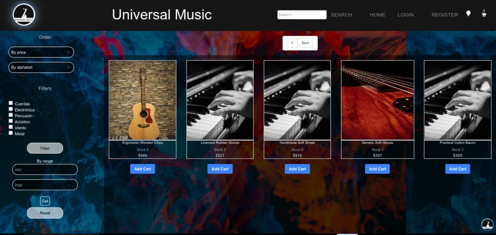
 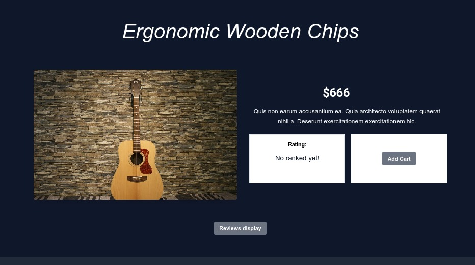
 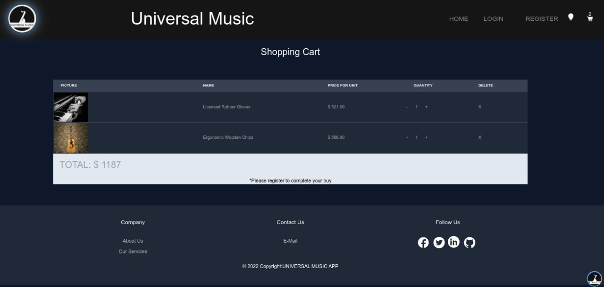

 - _PI Foods_
 <a href="https://github.com/KuraiRantan/PI-Foods" target="_blank">Repo</a>
 <a href="https://pi-foods-nu.vercel.app/" target="_blank">Deploy</a>
 
 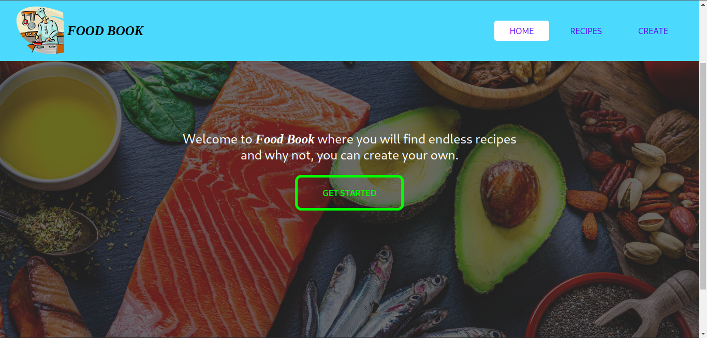
 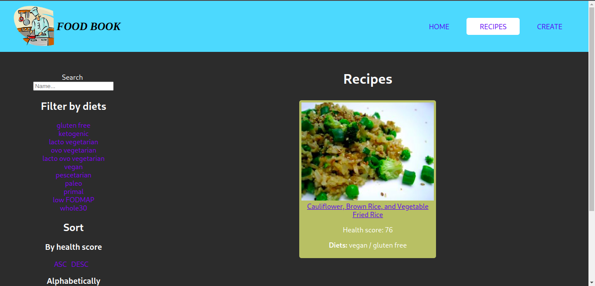
 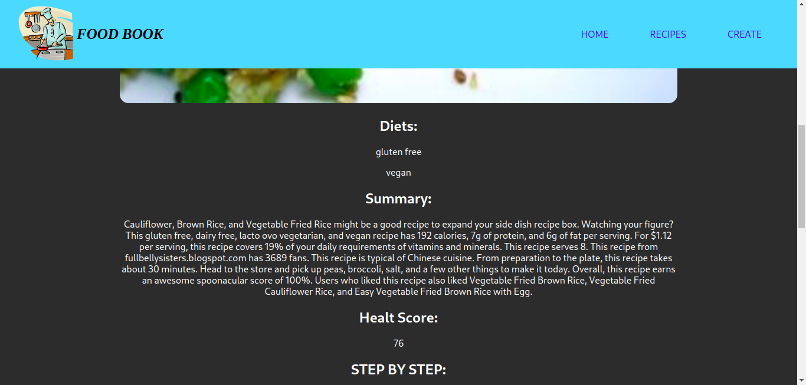
 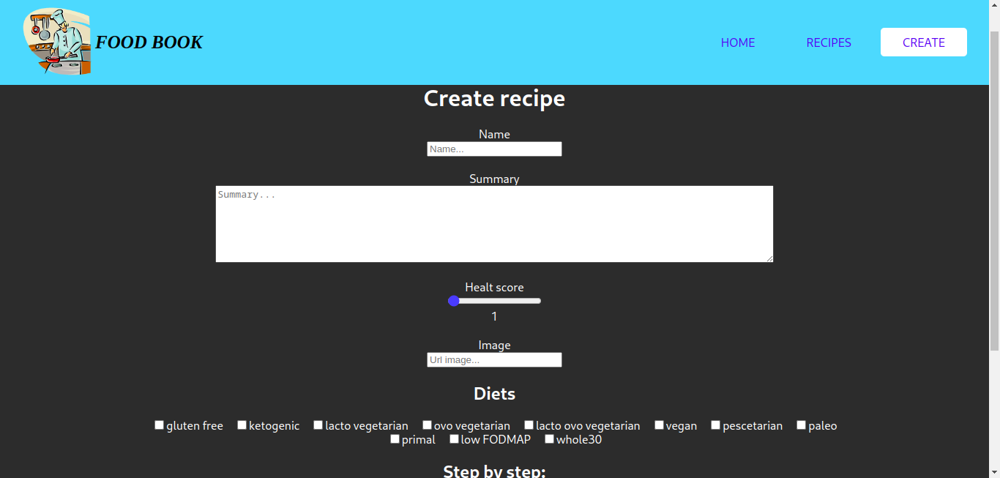
 
  - _El tiempo_
 <a href="https://github.com/KuraiRantan/el-tiempo" target="_blank">Repo</a>
 <a href="https://el-tiempo.vercel.app/" target="_blank">Deploy</a>
 
 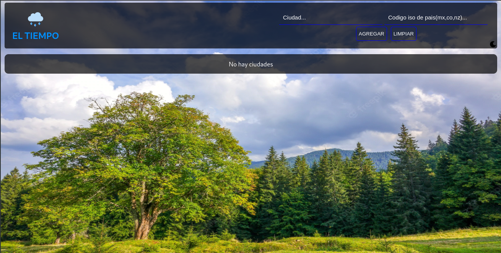
 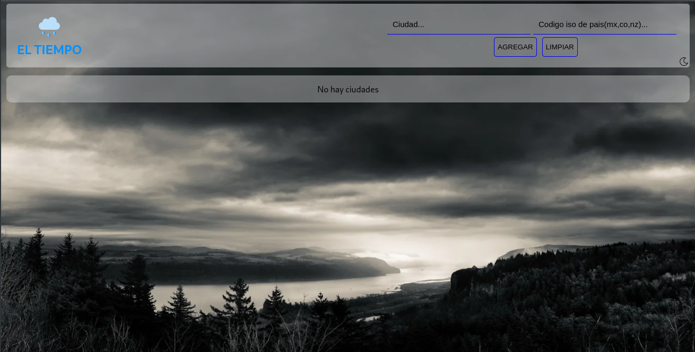
 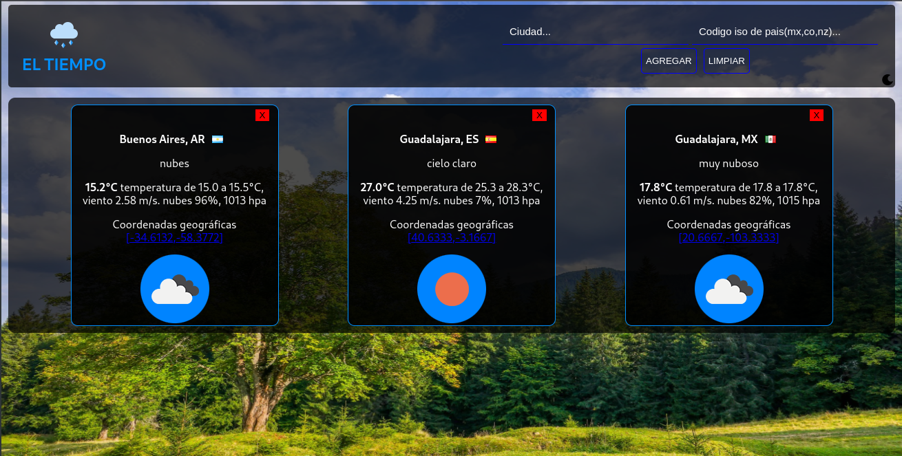
 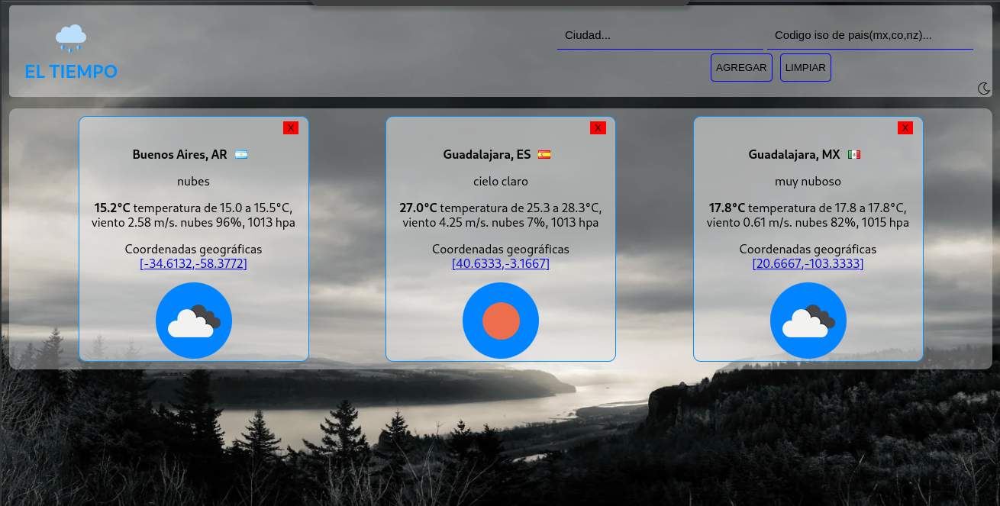

 - _Inventario_
 

https://user-images.githubusercontent.com/98563745/205494673-8bbced25-e14b-4771-9c68-d03b74262364.mp4

<h3> 📊 GitHub Stats:</h3>

 
 

### 🌐 Socials:
 
 

